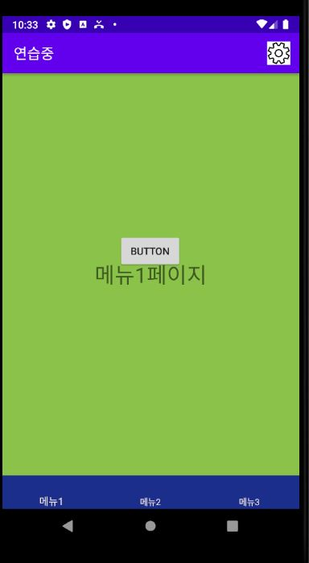

# Q. 기본 앱 화면을 구성하라!

1. 상단 ActionBar에 setting 메뉴를 추가하고 클릭 시 setting 화면으로 이동한다.
2. Bottom menu 클릭 시 각 ;화면이 Fragment로 동작
3. 메뉴1 화면의 버튼 클릭 시 Toast 동작
4. 메뉴2 화면의 버튼 클릭 시 AlertDialog 동작
5. 메뉴3 화면의 버튼 클릭 시 Progress 동작

