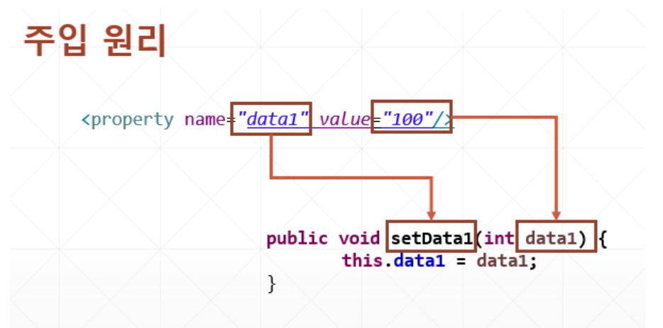

# Setter 메서드를 통한 주입

- Bean을 정의할 때 Bean 객체가 가지고 있을 기본 값을 생성자가 아닌 Setter 메서드를 통해 주입할 수 있다.



## Setter를 통한 주입 예제

- <beans.xml>

  ```xml
  <bean id="t1" class="kr.co.softcampus.beans.TestBean">
  		<property name="data1" value="100"/>
  </bean>
  ```

- <TestBean.java>

  ```java
  package kr.co.softcampus.beans;
  
  public class TestBean {
  	
  	private int data1;
  
  	public int getData1() {
  		return data1;
  	}
  
  	public void setData1(int data1) {
  		this.data1 = data1;
  	}
  	
  }
  ```

- <MainClass.java>

  ```java
  		// spring 은 이렇게!(bean에 입력해줬기 때문에 밑에처럼)
  		ClassPathXmlApplicationContext ctx = new ClassPathXmlApplicationContext("kr/co/softcampus/config/beans.xml");
  		TestBean t1 = ctx.getBean("t1", TestBean.class);
  		System.out.printf("t1.data1 : %d\\n", t1.getData1());
  		
  		
  		ctx.close();
  ```

## 객체 주입 예제

- 객체주입예제

  - TestBean.java에 변수를 입력해준다.

    ```java
    private DataBean data5;
    ```

  - getter,setter를 만든다.

  ```java
  public DataBean getData5() {
  		return data5;
  	}
  
  	public void setData5(DataBean data5) {
  		this.data5 = data5;
  	}
  ```

  - beans.xml에 property를 입력해준다.
    - DataBean객체를 data5에 집어넣겠다!

  ```xml
  <property name="data5">
  			<bean class="kr.co.softcampus.beans.DataBean"/>
  	</property>
  ```

  - [MainClass.java](http://mainclass.java) 에서 system.out.printf로 확인해본다.

  ```java
  System.out.printf("t1.data5 : %s\\n", t1.getData5());
  ```

- 이미 정의되어있는 DataBean을 가져다 쓰겠다! 예제

  - 변수를 선언한다.

  ```java
  private DataBean data6;
  ```

  - getter,setter를 만든다,

  ```java
  public DataBean getData6() {
  		return data6;
  	}
  
  	public void setData6(DataBean data6) {
  		this.data6 = data6;
  	}
  ```

  - beans.xml에 property를 적어준다.

  ```xml
  	<bean id="t1" class="kr.co.softcampus.beans.TestBean">
  		<property name="data1" value="100"/>
  		<property name="data2" value="11.11"/>
  		<property name="data3" value="true"/>
  		<property name="data4" value="안녕하세요"/>
  		<property name="data5">
  			<bean class="kr.co.softcampus.beans.DataBean"/>
  		</property>
  		<property name="data6" ref="data_bean"/> 
  	</bean>
  	
  	<bean id="data_bean" class="kr.co.softcampus.beans.DataBean">
  	
  	</bean>
  	
  						
  </beans>
  ```

  - MainClass.java에 printf를 통해 잘 찍히나 확인한다.

  ```java
  ClassPathXmlApplicationContext ctx = new ClassPathXmlApplicationContext("kr/co/softcampus/config/beans.xml");
  		TestBean t1 = ctx.getBean("t1", TestBean.class);
  		System.out.printf("t1.data1 : %d\\n", t1.getData1());
  		System.out.printf("t1.data2 : %f\\n", t1.getData2());
  		System.out.printf("t1.data3 : %s\\n", t1.isData3());
  		System.out.printf("t1.data4 : %s\\n", t1.getData4());
  		System.out.printf("t1.data5 : %s\\n", t1.getData5());
  		System.out.printf("t1.data6 : %s\\n", t1.getData6());
  ```