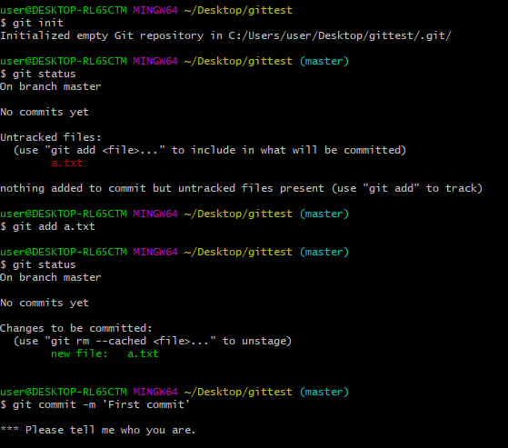
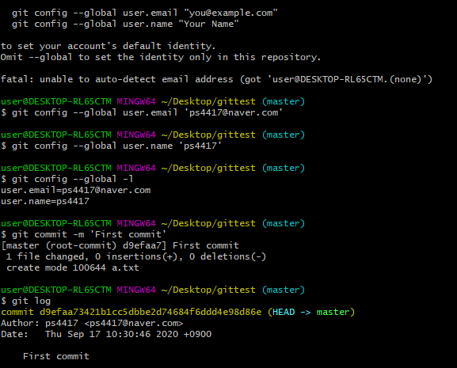

# Github

# Github이란?

- 분산 버전관리 시스템
- 코드의 history를 관리하는 도구
- 개발된 과정과 역사를 볼 수  있으며, 프로젝트의 이전 버전을 복원하고 변경사항 비교,분석,병합 등이 가능

## git vs github

- git은 버전관리 시스템중 하나
- gitHub은 git 원격저장소 서비스 중 하나

## 자료

### 1. git 자료

git 입문/ 발전편  [https://backlog.com/git-tutorial/kr/intro/intro1_1.html](https://backlog.com/git-tutorial/kr/intro/intro1_1.html)  

git 책  [https://git-scm.com/book/ko/v2](https://git-scm.com/book/ko/v2)

### 2. 채용

웹백엔드  [https://programmers.co.kr/competitions/416/2020-web-be-second](https://programmers.co.kr/competitions/416/2020-web-be-second)

### 3. 기타 자료

기술 면접 가이드  [https://github.com/JaeYeopHan/Interview_Question_for_Beginner](https://github.com/JaeYeopHan/Interview_Question_for_Beginner)

카카오 기술 블로그  [https://tech.kakao.com/](https://tech.kakao.com/)

네이버 D2  [https://d2.naver.com/helloworld](https://d2.naver.com/helloworld)

Toast -웹  [https://meetup.toast.com/](https://meetup.toast.com/)

카카오 모빌리티(정보)  [https://brunch.co.kr/@kakaomobility/58](https://brunch.co.kr/@kakaomobility/58)

커밋 메시지 사전  [https://blog.ull.im/engineering/2019/03/10/logs-on-git.html](https://blog.ull.im/engineering/2019/03/10/logs-on-git.html)

좋은 커밋 메시지 작성법  [https://meetup.toast.com/posts/106](https://meetup.toast.com/posts/106)

## Github을 위한 자료 다운

typora [https://typora.io/#windows](https://typora.io/#windows)   

비주얼스튜디오 [https://code.visualstudio.com/docs/?dv=win](https://code.visualstudio.com/docs/?dv=win) 

깃헙 학생 팩 [https://education.github.com/discount_requests/student_application](https://education.github.com/discount_requests/student_application) 

 git for window [https://gitforwindows.org/](https://gitforwindows.org/)    

---

## Git CLI 사용하기

1. gitforwindow setup하고
2. 바탕화면에 gittest 폴더 만들고
3. 마우스 우클릭 git bash here 클릭

## 리눅스 명령어

- ls  = list
- mkdir = make directory
- cd  = change
- touch  = 빈 text 파일 만드는 것

## 타이포라 환경설정 (마크다운 사용을 위한)

## 프로젝트 깃헙에 올릴 때 중요사항

1. 배포되면 best
2. 핵심 페이지 기능 구현되어있으면 좋을듯
3. .gitingore
4. Airbnb javascript 스타일 가이드 등등 하나를 참고해서 지키면 좋음

## 개발하는 과정 속에서

- 코드 컨벤션
- 내가 원하는 순간에 커밋
    - 언제 커밋해요? - 내가 원할 때 하는거야~
    - 버전을 남기고 싶을 때. but, 문제가 발생할 때 커밋은 NO!

- 커밋 메시지
    - 일관성 있게 작성 (한/영 상관 없음)
    - [https://meetup.toast.com/posts/106](https://meetup.toast.com/posts/106)      ← 참고하자!
    1. 제목과 본문을 한 줄 띄워 분리하기
    2. 제목은 영문 기준 50자 이내로
    3. 제목 첫 글자를 대문자로
    4. 제목 끝에 `.` 금지
    5. 제목은 `명령조` 로

## 뭔가를 배울 때

- 배운 내용을 마크다운으로 작성해서 정리하자.
- TIL 폴더에 하나씩 쌓아보자.
- ex) 알고리즘 1일 1문제 정리
- ex) 자바 배웠던거 단계적 커밋
- ex) 기존 프로젝트 업로드

## 프로젝트나 저장소 관리

- README를 100% 활용하자
- 프로젝트에 맞춤형으로 작성을 하자.
    - .gitignore

## 왜 이렇게 정리를 해야하나?

- 백엔드 개발자를 꿈꾸는 학생 개발자에게
    - [https://d2.naver.com/news/3435170](https://d2.naver.com/news/3435170)

- 문서화는 개발자의 하나의 덕목.
    - 사내 문서

- 알고리즘 문제풀이도 마크다운으로 깃헙에 정리!

## 프로젝트에 맞는 깃 이그노어 파일

[https://www.toptal.com/developers/gitignore](https://www.toptal.com/developers/gitignore)

## Github pages

[https://pages.github.com/](https://pages.github.com/)

- 포트폴리오 폴더(로컬)
    - git 저장소 만들어서commit

- github
    - 원격 저장소 이름을 username.github.io
        - 예) Multicampus → MultiCampus.github.io
    - push
- https://Multicampus.github.io

(깨알 팁!   fontawesome - 아이콘 제공해줌)

## 기술블로그

> 보통 github pages 를 통해 무료 호스팅 서비스를 제공받고, 여기에 정적 파일 생성기(static generator)를 활용한다.

### 마크다운 문서를 템플릿으로 변경해주는 툴

1. Jekyll  [https://jekyllrb-ko.github.io/](https://jekyllrb-ko.github.io/)
2. Gatsby js [https://www.gatsbyjs.com/](https://www.gatsbyjs.com/)

서비스별로 제공되는 템플릿이 있어서 마음에 드는 것을 선택해서 적용

.md ⇒ html,css,js로 변환해준다.

- jekyll
    - ruby
- gatsby
    - node.js(js)
    - react + graphQL → 최신 웹
    - 가장 최신의 것. 그래서 정보가 많음

so ⇒ 마크다운으로만 잘 작성하면 저 위의 툴들로 기술 블로그를 만들 수 있다.

- 설정 ⇒ 블로그 잘 따라하면 된다.
- 커스텀 ⇒ 웹 기반지식 필요
- 명령어를 치면 ⇒ 바로 변환