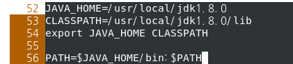
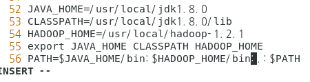
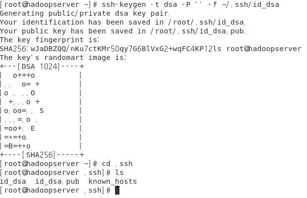
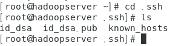
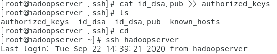
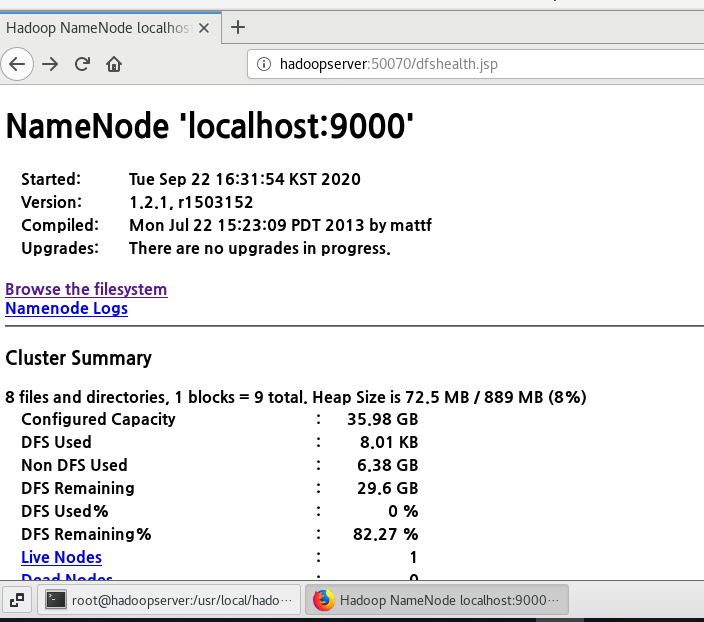
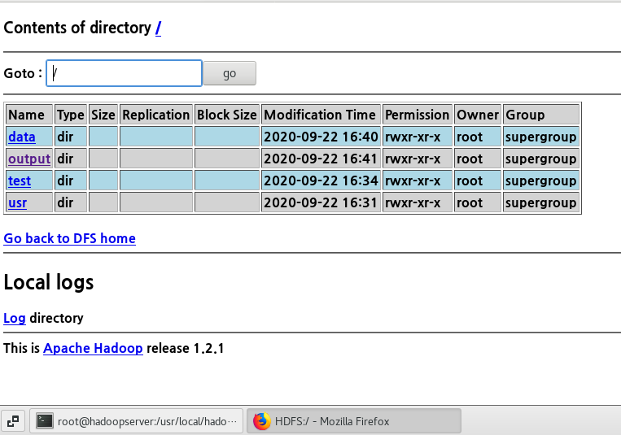
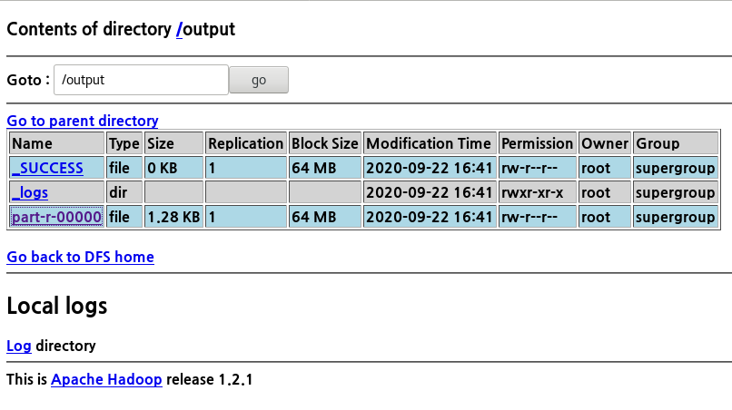

# Hadoop 설치 및 환경설정

### 자바 설치 (jdk설치)

[jdk설치및 설정방법](https://www.notion.so/c3942a4c149c4eed80d6506d266b5e7e)

Firewall stop

- systemctl stop firewalld
- systemctl disable firewalld

### 리눅스 서버 준비(hadoopserver 준비)

1. hostname 변경

* hostnamectl set-hostname hadoopserver

- vi /etc/hosts

  192.168.111.119  hadoopserver

2. 자바 경로 환경변수 등록



### hadoop 설치

- wget https://archive.apache.org/dist/hadoop/common/hadoop-1.2.1/hadoop-1.2.1.tar.gz
- tar xvf hadoop xxxxx
- cp -r hadoop-1.2.1 /usr/local   (/usr/local에 복사 )
- vi /etc/profile
- HADOOP_HOME 지정



- reboot 하세요~

### 보안 설정(SSH setting)

- ssh-keygen -t dsa -P '' -f ~/.ssh/id_dsa



>  id_dsa.pub 은 public 키를 의미해!



> 권한키 부여    cat id_dsa.pub >> authorized_keys



### 하둡 환경설정 파일 수정

cd /usr/local

cd hadoop-1.2.1/

cd conf

- vi core-site.xml

```xml
<configuration>

<property>

<name>fs.default.name</name>

<value>hdfs://localhost:9000</value>

</property>

<property>

<name>hadoop.tmp.dir</name>

<value>/usr/local/hadoop-1.2.1/tmp</value>

</property>

</configuration>
```


- vi hdfs-site.xml

```xml
<configuration>

<property>

<name>dfs.replication</name>

<value>1</value>

</property>

<property>

<name>dfs.webhdfs.enabled</name>

<value>true</value>

</property>

<property>

<name>dfs.name.dir</name>

<value>/usr/local/hadoop-1.2.1/name</value>

</property>

<property>

<name>dfs.data.dir</name>

<value>/usr/local/hadoop-1.2.1/data</value>

</property>

</configuration>
```


- vi mapred-site.xml

```xml
<configuration>

<property>

<name>mapred.job.tracker</name>

<value>localhost:9001</value>

</property>

</configuration>
```


- vi hadoop.env.sh
  - 9라인 수정 →   export JAVA_HOME=/usr/local/jdk1.8.0
  - 10라인 입력(추가)→  export HADOOP_HOME_WARN_SUPPRESS="TRUE"


### Hadoop 실행

- 포맷:   hadoop namenode -format
- start-all.sh
- jps
- 웹 인터페이스 → http://hadoopserver:50070



### Test

- cd hadoop-1.2.1/
- hadoop fs -mkdir /test
- hadoop fs -put README.txt /test
- hadoop jar hadoop-examples-1.2.1.jar wordcount /test /output




