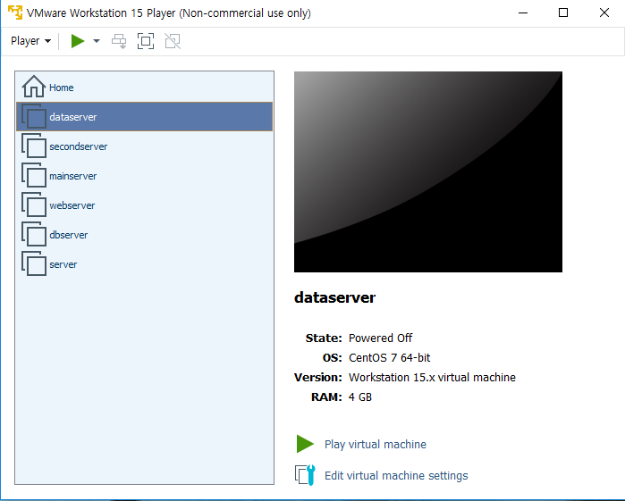
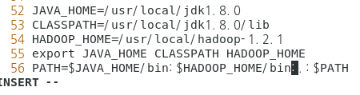

# 완전분산 모드

## 실습

### 1. C: >LINUX > server 복사본 3개를 만든다.

- 각각 mainserver, secondserver, dataserver 로 만든다.

- VM ware에 각각의 virtual machine이 나오도록 만든다.

### 2. JDK를 설치한다.

### 3. hostname , ipport설정- 3개 전부

### 4.  authorized_keys 부여

ssh-copy-id -i /root/.ssh/id_dsa.pub root@mainserver

ssh-copy-id -i /root/.ssh/id_dsa.pub root@secondserver

ssh-copy-id -i /root/.ssh/id_dsa.pub root@dataserver

### 5. main에 있는 파일들 secondserver, dataserver로 보내기

scp /etc/hosts root@secondserver:/etc/hosts

scp /etc/hosts root@dataserver:/etc/hosts

cd 다운로드

ls

scp ./jdk-8u261-linux-x64.tar.gz root@secondserver:/root

scp ./jdk-8u261-linux-x64.tar.gz root@dataserver:/root

scp /usr/bin/java root@secondserver:/usr/bin/java

scp /usr/bin/java root@dataserver:/usr/bin/java

ssh root@secondserver tar xvf /root/jdk*

ssh root@dataserver tar xvf /root/jdk*

ssh root@secondserver mv jdk1.8.0_261 jdk1.8.0

ssh root@dataserver mv jdk1.8.0_261 jdk1.8.0

ssh root@secondserver cp -r /root/jdk1.8.0 /usr/local

ssh root@dataserver cp -r /root/jdk1.8.0 /usr/local

### 6. hadoop 설치

하둡 설치하고

wget https://archive.apache.org/dist/hadoop/common/hadoop-1.2.1/hadoop-1.2.1.tar.gz

tar xvf hadoop-1.2.1.tar.gz

cp -r hadoop-1.2.1 /usr/local [root@mainserver ~]# vi /etc/profile

- HADOOP_HOME 지정

/etc/profile도  scp로 보내 [root@mainserver ~]# scp /etc/profile root@secondserver:/etc/profile [root@mainserver ~]# scp /etc/profile root@dataserver:/etc/profile

### 7. 하둡 환경설정 파일 수정

cd /usr/local

cd hadoop-1.2.1/

cd conf

- vi core-site.xml

<configuration> <property>

<name>fs.default.name</name>

<value>hdfs://mainserver:9000</value>

</property>

<property>

<name>hadoop.tmp.dir</name>

<value>/usr/local/hadoop-1.2.1/tmp</value>

</property> </configuration>

- vi hdfs-site.xml

<configuration> <property>

<name>dfs.replication</name>

<value>2</value>

</property>

<property>

<name>dfs.webhdfs.enabled</name>

<value>true</value>

</property>

<property>

<name>dfs.name.dir</name>

<value>/usr/local/hadoop-1.2.1/name</value>

- vi mapred-site.xml

<configuration> <property>

<name>mapred.job.tracker</name>

<value>mainserver:9001</value>

</property> </configuration>

- vi [hadoop-env.sh](http://hadoop-env.sh)

9라인 수정 →   export JAVA_HOME=/usr/local/jdk1.8.0

10라인 입력(추가)→  export HADOOP_HOME_WARN_SUPPRESS="TRUE"

- vi masters 치고 들어가서

secondserevr 입력

- vi slaves 치고들어가서

secondserver

dataserver 입력

tar cvfz hadoop.tar.gz ./hadoop-1.2.1

scp hadoop.tar.gz root@secondserver:/usr/local

scp hadoop.tar.gz root@dataserver:/usr/local

ssh root@secondserver tar xvf /usr/local/hadoop.tar.gz

ssh root@dataserver tar xvf /usr/local/hadoop.tar.gz

ssh root@secondserver mv /root/hadoop-1.2.1 /usr/local ssh root@dataserver mv /root/hadoop-1.2.1 /usr/local

### 8. Hadoop 실행

- hadoop 쳐서 실행
- 포맷:   hadoop namenode -format
- start-all.sh
- jps
- secondserver, dataserver 에 각각 jps 치기
- 웹 인터페이스 → http://mainserver:50070

### 9. Test

https://dataverse.harvard.edu/dataset.xhtml?persistentId=doi:10.7910/DVN/HG7NV7

bzip2 -d 2007.csv.bz2  (압축풀기)

hadoop fs -mkdir /air

hadoop fs -put 2007.csv /ai

hadoop fs -mkdir /air [root@mainserver 다운로드]# hadoop fs -put 2007.csv /air [root@mainserver 다운로드]# cd /usr/local/hadoop-1.2.1/ [root@mainserver hadoop-1.2.1]# hadoop jar hadoop-examples-1.2.1.jar wordcount /air /output

## 완전분산→ 가상분산방식으로 다시 바꾸기

- stop-all.sh
- vi core-site.xml
- vi hdfs-site.xml
- vi mapred-site.xml
- vi masters   (들어가서 내용을 localhost로 변경)
- vi slaves    (들어가서 내용을 localhost로 변경)
- hadoop 쳐서 실행
- 포맷:   hadoop namenode -format
- start-all.sh
- jps  쳐서 5개 나오는지 확인

